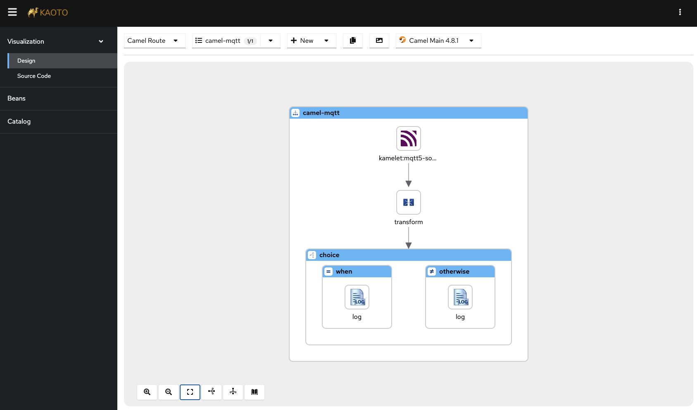

# MQTT

This example is using Camel to receive MQTT events from an external MQTT broker,
as illustrated below.



## Install Camel CLI

<!-- see installation instructions in ../install.adoc -->

## Running MQTT Broker

You need to run a MQTT broker such as via Docker, Camel Infra, or download and run Apache ActiveMQ Artemis.

### Using Camel Infra

The MQTT broker can be run using Camel Infra command:

```shell
camel infra run mqtt
```

### Using Docker compose

To use docker (docker compose), you can run the following command:

```shell
start.sh
```

Or use

```shell
docker compose up --detach
```

## How to run

Then you can run the Camel integration using:

```shell
camel run mqtt.camel.yaml application.properties
```

And then from another terminal (or run the integration with `--background` option),
then send a message to the MQTT broker. This can be done with the help from camel-jbang
where you can send a message as follows:

```shell
camel cmd send mqtt --body=file:test/payload.json
```

This will send a message where the payload (body) is read from the local file named payload.json.
The message is sent to an existing running Camel integration (named mqtt). Then Camel will
send the message to the MQTT broker. So in other words we use Camel as a proxy to send the
message to the actual MQTT broker.

The Camel integration will then consume the payload and output in the console.

```text
2023-04-14 08:58:58.676  INFO 62348 --- [calCliConnector] mqtt.camel.yaml:27                  : Warm temperature at 21
```

Now send another sample file `payload-low.json` and see what is the output now.

```shell
camel cmd send mqtt --body=file:test/payload-low.json
```

## Stopping

To stop Docker, you can run

```shell
docker compose down
```

And you can stop Camel with

```shell
camel stop mqtt
```

## Integration testing

The example provides an automated integration test (`mqtt.citrus.it.yaml`) that you can run with the [Citrus](https://citrusframework.org/) test framework.
Please make sure to install Citrus as a JBang application (see [Citrus installation guide](../../install-citrus.adoc)).

You can run the test with:

```shell
citrus run test/mqtt.citrus.it.yaml
```

The test prepares the complete infrastructure (e.g. via Docker compose) and starts the Camel route automatically via JBang.
The test sends some test data to the MQTT broker and verifies that the Camel route successfully processes the messages.

## Help and contributions

If you hit any problem using Camel or have some feedback, then please
[let us know](https://camel.apache.org/community/support/).

We also love contributors, so
[get involved](https://camel.apache.org/community/contributing/) :-)

The Camel riders!
